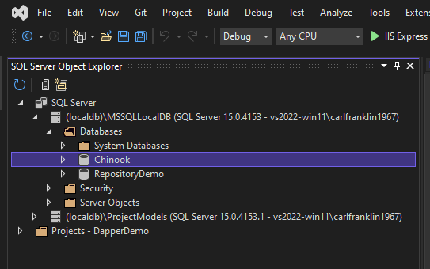
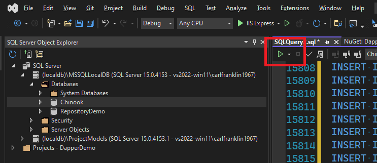
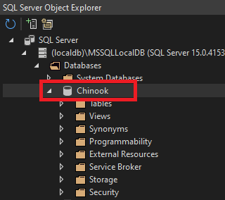
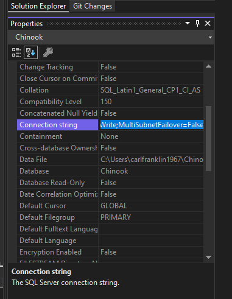
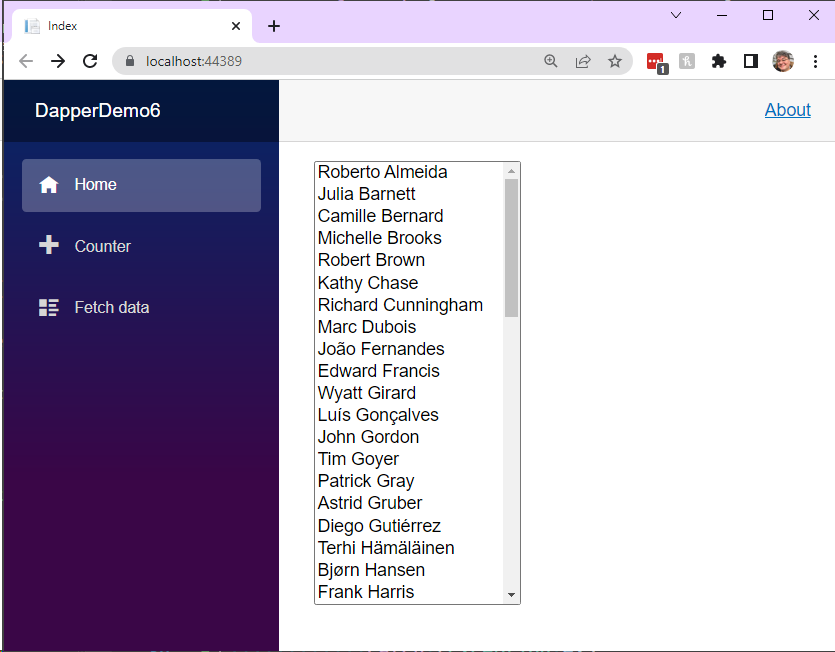

# Using Dapper with Blazor

## Overview

Dapper is an open-source ORM that provides a fast, convenient interface for accessing SQL server databases.

In this module we will create a generic Dapper repository that we can use for any SQL database with minimal coding that addresses multiple primary key formats.

The Dapper Repo can be found at https://github.com/DapperLib/Dapper

We are also going to be using the `Dapper.Contrib` library, which adds helper methods to make accessing Dapper even easier. This repo can be found at https://github.com/DapperLib/Dapper.Contrib

### Databases

This demo uses three databases, each with a different type of primary key.

#### Chinook:

The Primary Key of Customer table is an int and is not auto-generated.

Download the SQL script here:

https://github.com/lerocha/chinook-database/blob/master/ChinookDatabase/DataSources/Chinook_SqlServer.sql

Index.razor demonstrates accessing the Chinook Customer table.

#### Northwind:

The Primary Key for the Customers table is a string.

Download the SQL script here:

https://github.com/microsoft/sql-server-samples/blob/master/samples/databases/northwind-pubs/instnwnd.sql

FetchData.razor demonstrates accessing the Northwind Customers table.

#### BandBooker:

The Primary Key is an int and IS auto-generated

BandBooker.sql (included)

Counter.razor demonstrates accessing the BandBooker Instrument table.

### DapperDemo

We'll be using Blazor Server, but you can easily use Blazor WebAssembly accessing Dapper on the server side with a manager being called from API endpoints, a gRPC service, or what have you.

Create a new Blazor Server application called `DapperDemo`, and add the following NuGet packages to the .csproj file:

```xml
<ItemGroup>
    <PackageReference Include="Dapper" Version="2.0.123" />
    <PackageReference Include="Dapper.Contrib" Version="2.0.78" />
    <PackageReference Include="System.Data.SqlClient" Version="4.8.3" />
</ItemGroup>
```

Add the following global using statements to the very top of *Program.cs*:

```c#
global using System.Data.SqlClient;
global using Dapper;
global using Dapper.Contrib.Extensions;
global using System.Linq.Expressions;
global using System.Data;
```

### Install Databases

This demo maps models to three tables from three different databases. Each table has a different kind of primary key (PKey). **Chinook**'s Customer table has an Int Id PKey that is NOT an identity property, meaning it is not auto-generated. **BandBooker**'s Instrument table has an Int Id PKey that IS an identity. **Northwind**'s Customers table has a string PKey that is obviously not an identity. We're going to start with **Chinook**

Using the **Sql Server Object Explorer** window in Visual Studio, create a new Database under LocalDB called *Chinook*



Download the Chinook SQL script:

https://raw.githubusercontent.com/lerocha/chinook-database/master/ChinookDatabase/DataSources/Chinook_SqlServer.sql

Right-click on the **Chinook** database and select **New Query...**

Copy the SQL Script into the query window and click the green **Play** button to execute the script



Bring up the **Properties** window while the Chinook database is selected and expanded, and copy the `ConnectionString` property into the clipboard:





Add `ChinookConnectionString` to *appsettings.json*

```json
{
  "Logging": {
    "LogLevel": {
      "Default": "Information",
      "Microsoft": "Warning",
      "Microsoft.Hosting.Lifetime": "Information"
    }
  },
  "AllowedHosts": "*",
  "ConnectionStrings": {
    "ChinnokConnectionString": "Data Source=(localdb)\\MSSQLLocalDB;Initial Catalog=Chinook;Integrated Security=True;Connect Timeout=30;Encrypt=False;TrustServerCertificate=False;ApplicationIntent=ReadWrite;MultiSubnetFailover=False"
  }
}
```

If you want to generate models for the Chinook Database, you can use the Visual Studio Scaffolding support for this, which is really to support Entity Framework. Even though we're not going to use EF in this project, the scaffolding is still useful to generate the models.

If you want to generate models, add these packages to the .csproj file:

```xml
<PackageReference Include="Microsoft.EntityFrameworkCore.SqlServer" Version="6.0.3" />
<PackageReference Include="Microsoft.EntityFrameworkCore.Tools" Version="6.0.3">
    <PrivateAssets>all</PrivateAssets>
    <IncludeAssets>runtime; build; native; contentfiles; analyzers; buildtransitive</IncludeAssets>
</PackageReference>
<PackageReference Include="Microsoft.VisualStudio.Web.CodeGeneration.Design" Version="6.0.2" />
```

To generate the models, open the **Package Manager Console** window and execute the following command:

```
Scaffold-DbContext "Data Source=(localdb)\MSSQLLocalDB;Initial Catalog=Chinook;Integrated Security=True;Connect Timeout=30;Encrypt=False;TrustServerCertificate=False;ApplicationIntent=ReadWrite;MultiSubnetFailover=False" Microsoft.EntityFrameworkCore.SqlServer -OutputDir Models
```

Make sure you replace the connection string (in quotes) with your connection string if, indeed, they are different.

This command creates a Models folder and adds the model files to it.

Delete the file *ChinookContext.cs* from the Models folder. We don't need it.

We also need to clean up the models so they are mapped to the SQL tables, having no virtual properties.

Change *Models/Customer.cs* to this, or if you did NOT generate models, create a *Models* folder and add *Customer.cs* to it:

```c#
#nullable disable

[Table("Customer")]
public class Customer
{
    [ExplicitKey]
    public int CustomerId { get; set; } = 0;
    public string FirstName { get; set; }
    public string LastName { get; set; }
    public string Company { get; set; }
    public string Address { get; set; }
    public string City { get; set; }
    public string State { get; set; }
    public string Country { get; set; }
    public string PostalCode { get; set; }
    public string Phone { get; set; }
    public string Fax { get; set; }
    public string Email { get; set; }
}
```

#### BandBooker and Northwind Databases

The BandBooker database script is included with this repo, and the Northwind script can be downloaded from https://github.com/microsoft/sql-server-samples/blob/master/samples/databases/northwind-pubs/instnwnd.sql

We will get to these later.

#### Simple Demo

To illustrate the simplicity of `Dapper` and `Dapper.Contrib`, replace *Index.razor* with the following:

```c#
@page "/"
@inject IConfiguration Configuration

<PageTitle>Index</PageTitle>

@if (Customers != null)
{
    <select size="20">
        @foreach (var customer in Customers)
        {
            <option>@customer.FirstName @customer.LastName</option>
        }
    </select>
}

@code
{
    #nullable disable
    List<Customer> Customers { get; set; }
    protected override async Task OnInitializedAsync()
    {
        var connStr = Configuration.GetSection("ConnectionStrings")["ChinnokConnectionString"];

        using (IDbConnection db = new SqlConnection(connStr))
        {
            try
            {
                var result = await db.QueryAsync<Customer>("select * from customer order by LastName");
                if (result != null)
                {
                    Customers = result!.ToList();
                }
            }
            catch (Exception ex)
            {
                var msg = ex.Message;
            }
        }
    }
}
```

Run the app and you should see something like this:



#### Repository Pattern

Now, let's create a generic repository interface that we can use on the server to access a database, and on the client to access an API or service calls to the server:

To the *Data* folder, add *IRepository.cs*

```c#
public interface IRepository<TEntity> where TEntity : class
{
    Task<IEnumerable<TEntity>> GetAllAsync();
    Task<IEnumerable<TEntity>> GetAsync(string query);
    Task<IEnumerable<TEntity>> GetAsync(
        Expression<Func<TEntity, bool>> filter = null,
        Func<IQueryable<TEntity>, IOrderedQueryable<TEntity>> orderBy = null,
        string includeProperties = "");
    Task<TEntity> InsertAsync(TEntity entity);
    Task<TEntity> UpdateAsync(TEntity entityToUpdate);
    Task<bool> DeleteAsync(TEntity entityToDelete);
}
```

The Dapper-specific generic repository we are about to create uses a class that I built to generate an insert statement when the PKey is a string.

To the Data folder, add *DapperSqlHelper.cs*:

```c#
public class DapperSqlHelper
{
    public static string GetDapperInsertStatement(object Entity, string TableName)
    {
        // let's get the SQL string started.
        string sql = $"insert into {TableName} (";

        // Get the type, and the list of public properties
        var EntityType = Entity.GetType();
        var Properties = EntityType.GetProperties();

        foreach (var property in Properties)
        {
            // Is this property nullable?
            if (Nullable.GetUnderlyingType(property.PropertyType) != null)
            {
                // yes. get the value.
                var value = property.GetValue(Entity);
                // is the value null?
                if (value != null)
                    // only add if the value is not null
                    sql += $"{property.Name}, ";
            }
            // is this property virtual (like Customer.Invoices)?
            else if (property.GetGetMethod().IsVirtual == false)
            {
                // not virtual. Include
                sql += $"{property.Name}, ";
            }
        }

        // At this point there is a trailing ", " that we need to remove
        sql = sql.Substring(0, sql.Length - 2);

        // add the start of the values clause
        sql += ") values (";

        // Once more through the properties
        foreach (var property in Properties)
        {
            if (Nullable.GetUnderlyingType(property.PropertyType) != null)
            {
                var value = property.GetValue(Entity);
                if (value != null)
                    // inserts in Dapper are paramterized, so at least
                    // we don't have to figure out data types, quotes, etc.
                    sql += $"@{property.Name}, ";
            }
            else if (property.GetGetMethod().IsVirtual == false)
            {
                sql += $"@{property.Name}, ";
            }
        }

        // again, remove the trailing ", " and finish with a closed paren 
        sql = sql.Substring(0, sql.Length - 2) + ")";

        // we're outta here!
        return sql;
    }
}
```

#### DapperRepository

Because we have defined *IRepository* to support generics, we can create a repository for Dapper that will work with any SQL Database and any Table. On top of that, it's flexible enough to handle the three PKey types:

1. Int, Non-Identity
2. Int, Identity
3. String

To the *Data* folder, add *DapperRepository.cs*:

```c#
public class DapperRepository<TEntity> : IRepository<TEntity> where TEntity : class
{
    private string _sqlConnectionString;
    private string entityName;
    private Type entityType;

    private string primaryKeyName;
    private string primaryKeyType;
    private bool PKNotIdentity = false;

    public DapperRepository(string sqlConnectionString)
    {
        _sqlConnectionString = sqlConnectionString;
        entityType = typeof(TEntity);
        entityName = entityType.Name;

        var props = entityType.GetProperties().Where(
            prop => Attribute.IsDefined(prop,
            typeof(KeyAttribute)));
        if (props.Count() > 0)
        {
            primaryKeyName = props.First().Name;
            primaryKeyType = props.First().PropertyType.Name;
        }
        else
        {
            // Default
            primaryKeyName = "Id";
            primaryKeyType = "Int32";
        }

        // look for [ExplicitKey]
        props = entityType.GetProperties().Where(
            prop => Attribute.IsDefined(prop,
            typeof(ExplicitKeyAttribute)));
        if (props.Count() > 0)
        {
            PKNotIdentity = true;
            primaryKeyName = props.First().Name;
            primaryKeyType = props.First().PropertyType.Name;
        }
    }

    public async Task<bool> DeleteAsync(TEntity entityToDelete)
    {
        using (IDbConnection db = new SqlConnection(_sqlConnectionString))
        {
            //string sql = $"delete from {entityName} where {primaryKeyName}" +
            //    $" = @{primaryKeyName}";
            try
            {
                //await db.ExecuteAsync(sql, entityToDelete);
                await db.DeleteAsync<TEntity>(entityToDelete);
                return true;
            }
            catch (Exception ex)
            {
                return false;
            }
        }

    }

    public async Task<IEnumerable<TEntity>> GetAsync(string Query)
    {
        using (IDbConnection db = new SqlConnection(_sqlConnectionString))
        {
            try
            {
                return await db.QueryAsync<TEntity>(Query);
            }
            catch (Exception ex)
            {
                return (IEnumerable<TEntity>)new List<TEntity>();
            }
        }
    }

    public async Task<IEnumerable<TEntity>> GetAsync(Expression<Func<TEntity, bool>>
        filter = null,
        Func<IQueryable<TEntity>, IOrderedQueryable<TEntity>> orderBy = null,
        string includeProperties = "")
    {
        throw new NotImplementedException();
    }

    public async Task<IEnumerable<TEntity>> GetAllAsync()
    {
        using (IDbConnection db = new SqlConnection(_sqlConnectionString))
        {
            db.Open();
            //string sql = $"select * from {entityName}";
            //IEnumerable<TEntity> result = await db.QueryAsync<TEntity>(sql);
            //return result;
            return await db.GetAllAsync<TEntity>();
        }
    }

    public async Task<TEntity> InsertAsync(TEntity entity)
    {
        using (IDbConnection db = new SqlConnection(_sqlConnectionString))
        {
            db.Open();
            // start a transaction in case something goes wrong
            await db.ExecuteAsync("begin transaction");
            try
            {
                // Get the primary key property
                var prop = entityType.GetProperty(primaryKeyName);

                // int key?
                if (primaryKeyType == "Int32")
                {
                    // not an identity?
                    if (PKNotIdentity == true)
                    {
                        // get the highest value
                        var sql = $"select max({primaryKeyName}) from {entityName}";
                        // and add 1 to it
                        var Id = Convert.ToInt32(db.ExecuteScalar(sql)) + 1;
                        // update the entity
                        prop.SetValue(entity, Id);
                        // do the insert
                        db.Insert<TEntity>(entity);
                    }
                    else
                    {
                        // key will be created by the database
                        var Id = (int)db.Insert<TEntity>(entity);
                        // set the value
                        prop.SetValue(entity, Id);
                    }
                }
                else if (primaryKeyType == "String")
                {
                    // string primary key. Use my helper
                    string sql = DapperSqlHelper.GetDapperInsertStatement(entity, entityName);
                    await db.ExecuteAsync(sql, entity);
                }
                // if we got here, we're good!
                await db.ExecuteAsync("commit transaction");
                return entity;
            }
            catch (Exception ex)
            {
                var msg = ex.Message;
                await db.ExecuteAsync("rollback transaction");
                return null;
            }
        }
    }

    public async Task<TEntity> UpdateAsync(TEntity entity)
    {
        using (IDbConnection db = new SqlConnection(_sqlConnectionString))
        {
            db.Open();
            try
            {
                //string sql = DapperSqlHelper.GetDapperUpdateStatement(entity, entityName, primaryKeyName);
                //await db.ExecuteAsync(sql, entity);
                await db.UpdateAsync<TEntity>(entity);
                return entity;
            }
            catch (Exception ex)
            {
                return null;
            }
        }
    }
}
```

To create a repository specific to the Customer table, we define and add it to builder.Services in Program.cs

Add to *Program.cs*:

```c#
builder.Services.AddSingleton<DapperRepository<Customer>>(s =>
    new DapperRepository<Customer>(
        builder.Configuration.GetConnectionString("ChinnokConnectionString")));
```

Replace *Index.razor* with the following:

```c#
@page "/"
@inject DapperRepository<Customer> CustomerManager

@if (Customers != null)
{
    <select @onchange="CustomerSelected" size="10" style="width:100%;">
        @foreach (var customer in Customers)
        {
            if (SelectedCustomer != null && customer.CustomerId == SelectedCustomer.CustomerId)
            {
                <option selected value="@customer.CustomerId">@customer.FirstName&nbsp;@customer.LastName</option>
            }
            else
            {
                <option value="@customer.CustomerId">@customer.FirstName&nbsp;@customer.LastName</option>
            }
        }
    </select>
    <br />
    <br />

    @if (CanIAddCarl)
    {
        <button @onclick="AddCustomer">Add Carl</button>
        <br />
        <br />
    }

    if (SelectedCustomer != null)
    {
        <div>
            Address: @SelectedCustomer.Address
        </div>
        <br />

        <button @onclick="DeleteCustomer">Delete @SelectedCustomer.FirstName  @SelectedCustomer.LastName</button>
        <br />
        <br />

        <button @onclick="UpdateCustomer">Update @SelectedCustomer.FirstName  @SelectedCustomer.LastName</button>
        <br />
        <br />
    }

    <span style="color:red;">@ErrorMessage</span>
}
else
{
    <span>Loading...</span>
}

@code
{
    List<Customer> Customers { get; set; }
    Customer SelectedCustomer;
    string ErrorMessage = "";

    bool CanIAddCarl
    {
        get
        {
            var carl = (from x in Customers
                        where x.FirstName == "Carl"
                        && x.LastName == "Franklin"
                        select x).FirstOrDefault();
            return (carl == null);
        }
    }

    async Task CustomerSelected(ChangeEventArgs args)
    {
        var Id = Convert.ToInt32(args.Value.ToString());
        SelectedCustomer = (from x in Customers where x.CustomerId == Id select x).FirstOrDefault();
        var dbCust = (await CustomerManager.GetAsync($"select * from customer where customerid = {Id}")).FirstOrDefault();
    }

    async Task UpdateCustomer()
    {
        ErrorMessage = "";
        SelectedCustomer.Address = $"Updated at {DateTime.Now.ToString()}";
        var updated = await CustomerManager.UpdateAsync(SelectedCustomer);
        if (updated == null)
        {
            ErrorMessage = "Could not update Customer";
        }
    }

    async Task AddCustomer()
    {
        ErrorMessage = "";
        var customer = new Customer()
        {
            Address = "Nowhere Street",
            City = "Hooverville",
            Company = "Acme",
            Country = "USA",
            Email = "carl@somewhere.com",
            Fax = "888-555-1212",
            FirstName = "Carl",
            LastName = "Franklin",
            Phone = "888-555-1212",
            PostalCode = "ABCDE",
            State = "XX"
        };
        var newCustomer = await CustomerManager.InsertAsync(customer);
        if (newCustomer != null)
            await LoadAllCustomers();
        else
            ErrorMessage = "Could not insert customer";
    }

    async Task DeleteCustomer()
    {
        ErrorMessage = "";
        var success = await CustomerManager.DeleteAsync(SelectedCustomer);
        if (success)
        {
            SelectedCustomer = null;
            await LoadAllCustomers();
        }
        else
        {
            ErrorMessage = "Customer could not be deleted";
        }
    }

    async Task LoadAllCustomers()
    {
        await Task.Delay(0);

        // Get all customers
        //var result = await CustomerManager.GetAll();

        // Get Customers that start with B
        //var result = await CustomerManager.GetAsync("select * from customer where lastname like 'b%' order by lastname");

        // Get Customers Sorted by Last Name
        var result = await CustomerManager.GetAsync("select * from customer order by lastname");

        Customers = result.ToList();

    }

    protected override async Task OnInitializedAsync()
    {
        await LoadAllCustomers();
    }
}
```

This demo exercises all of the CRUD methods. Try modifying a customer, deleting a customer, and adding me (Carl)

### BandBooker

Adding a new repository for another database and table is as simple as defining the model, adding the connection string to config, and adding the repository as a service in *Program.cs*

Add *Instrument.cs* to the *Models* folder

```c#
#nullable disable
[Table("Instrument")]
public class Instrument
{
    [Key]
    public int InstrumentId { get; set; }

    public string Name { get; set; }
}
```

Add the BandBookerConnectionString to *appsettings.json*

```json
{
  "Logging": {
    "LogLevel": {
      "Default": "Information",
      "Microsoft": "Warning",
      "Microsoft.Hosting.Lifetime": "Information"
    }
  },
  "AllowedHosts": "*",
  "ConnectionStrings": {
    "ChinnokConnectionString": "Data Source=(localdb)\\MSSQLLocalDB;Initial Catalog=Chinook;Integrated Security=True;Connect Timeout=30;Encrypt=False;TrustServerCertificate=False;ApplicationIntent=ReadWrite;MultiSubnetFailover=False",
    "BandBookerConnectionString": "Data Source=(localdb)\\MSSQLLocalDB;Initial Catalog=BandBooker;Integrated Security=True;Connect Timeout=30;Encrypt=False;TrustServerCertificate=False;ApplicationIntent=ReadWrite;MultiSubnetFailover=False"
  }
}
```

Add to *Program.cs*:

```c#
builder.Services.AddSingleton<DapperRepository<Instrument>>(s =>
    new DapperRepository<Instrument>(
        builder.Configuration.GetConnectionString("BandBookerConnectionString")));
```

Replace *Counter.razor* with the following:

```c#
@page "/counter"
@inject DapperRepository<Instrument> InstrumentManager

<h4>Step through the code to observe the CRUD actions</h4>

<button class="btn btn-primary" @onclick="Test">Click me</button>

@code {

    async Task Test()
    {
        // get all
        var instruments = await InstrumentManager.GetAllAsync();

        // add new
        var instrument = new Instrument() { Name = DateTime.Now.ToString() };
        var added = await InstrumentManager.InsertAsync(instrument);

        added.Name = $"Updated at {DateTime.Now.ToString()}";
        await InstrumentManager.UpdateAsync(added);

        await InstrumentManager.DeleteAsync(added);
    }
}
```

Place a breakpoint on the "Add New" line. Step through each line, and inspect the Instruments table.

### Northwind

The Northwind database Customers table defines the PKey as a string.

To the *Models* folder, add *Customers.cs*. Note that Customers is a plural form.

```c#
#nullable disable

[Table("Customers")]
public class Customers
{
    [ExplicitKey]
    public string CustomerID { get; set; }
    public string CompanyName { get; set; }
    public string ContactName { get; set; }
    public string ContactTitle { get; set; }
    public string Address { get; set; }
    public string City { get; set; }
    public string Region { get; set; }
    public string PostalCode { get; set; }
    public string Country { get; set; }
    public string Phone { get; set; }
    public string Fax { get; set; }
}
```

Add the NorthwindConnectionString to *appsettings.json*:

```json
{
  "Logging": {
    "LogLevel": {
      "Default": "Information",
      "Microsoft": "Warning",
      "Microsoft.Hosting.Lifetime": "Information"
    }
  },
  "AllowedHosts": "*",
  "ConnectionStrings": {
    "ChinnokConnectionString": "Data Source=(localdb)\\MSSQLLocalDB;Initial Catalog=Chinook;Integrated Security=True;Connect Timeout=30;Encrypt=False;TrustServerCertificate=False;ApplicationIntent=ReadWrite;MultiSubnetFailover=False",
    "BandBookerConnectionString": "Data Source=(localdb)\\MSSQLLocalDB;Initial Catalog=BandBooker;Integrated Security=True;Connect Timeout=30;Encrypt=False;TrustServerCertificate=False;ApplicationIntent=ReadWrite;MultiSubnetFailover=False",
    "NorthwindConnectionString": "Data Source=(localdb)\\MSSQLLocalDB;Initial Catalog=Northwind;Integrated Security=True;Connect Timeout=30;Encrypt=False;TrustServerCertificate=False;ApplicationIntent=ReadWrite;MultiSubnetFailover=False"
  }
}
```

Add the new service to *Program.cs*:

```c#
builder.Services.AddSingleton<DapperRepository<Customers>>(s =>
    new DapperRepository<Customers>(
        builder.Configuration.GetConnectionString("NorthwindConnectionString")));
```

Replace *FetchData.razor* with the following:

```c#
@page "/fetchdata"
@inject DapperRepository<Customers> CustomersManager

<h4>Step through the code to observe the CRUD actions</h4>

<button class="btn btn-primary" @onclick="Test">Click me</button>

@code {

    async Task Test()
    {
        // get all
        var customers = await CustomersManager.GetAllAsync();

        // add new
        var customer = new Customers()
            {
                CustomerID = "ABCDZ",
                CompanyName = DateTime.Now.ToString()
            };

        var added = await CustomersManager.InsertAsync(customer);

        added.CompanyName = $"Updated at {DateTime.Now.ToString()}";
        await CustomersManager.UpdateAsync(added);

        await CustomersManager.DeleteAsync(added);
    }
}
```

Step through the code as we did with Instruments to verify the code against the database.

